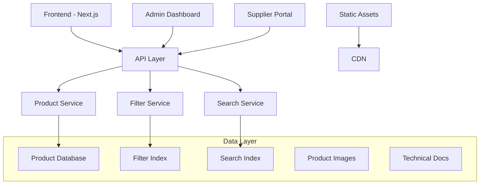

# Technical Specification: Industrial Product Catalog Enhancement

## Architecture Overview

### System Components


### Technology Stack
- **Frontend**: Next.js 15.0.3, React 18.3.1, TypeScript
- **State Management**: Redux Toolkit with persistence
- **Styling**: SCSS with component-based architecture
- **Build Tool**: pnpm (package manager)
- **Database**: PostgreSQL for product data, Redis for caching
- **Search**: Elasticsearch or built-in PostgreSQL full-text search
- **CDN**: Static asset delivery for product images and documents

## Data Architecture

### Enhanced B2B Product Schema

```typescript
interface IndustrialProduct extends B2BProduct {
  // Core product information (inherited from B2BProduct)
  id: string;
  supplierId: string;
  name: string;
  description: string;
  category: string;
  subcategory: string;
  sku: string;
  images: string[];
  
  // Enhanced industrial specifications
  specifications: IndustrialSpecifications;
  certifications: Certification[];
  commercialTerms: EnhancedCommercialTerms;
  negotiationVariables: NegotiationVariable[];
  
  // Industrial-specific fields
  industryApplications: string[];
  technicalDocuments: TechnicalDocument[];
  complianceRequirements: ComplianceRequirement[];
  materialGrades: MaterialGrade[];
  
  // Search and filtering
  searchKeywords: string[];
  filterTags: FilterTag[];
  
  // Metadata
  isActive: boolean;
  createdAt: Date;
  updatedAt: Date;
  lastReviewedAt: Date;
  dataQualityScore: number; // 0-100
}

interface IndustrialSpecifications {
  // Physical properties
  dimensions?: {
    length?: Measurement;
    width?: Measurement;
    height?: Measurement;
    diameter?: Measurement;
    thickness?: Measurement;
    weight?: Measurement;
  };
  
  // Material properties
  material?: {
    type: string; // "Steel", "Aluminum", "HDPE", etc.
    grade?: string; // "316L", "6061-T6", "Injection Grade", etc.
    composition?: MaterialComposition[];
    properties?: MaterialProperty[];
  };
  
  // Performance specifications
  performance?: {
    pressureRating?: Measurement;
    temperatureRange?: { min: number; max: number; unit: string };
    electricalRating?: ElectricalRating;
    mechanicalProperties?: MechanicalProperty[];
    chemicalResistance?: ChemicalResistance[];
  };
  
  // Manufacturing specifications
  manufacturing?: {
    tolerance?: Tolerance[];
    surfaceFinish?: SurfaceFinish;
    heatTreatment?: string;
    coatingOptions?: CoatingOption[];
  };
  
  // Custom specifications (flexible for different product types)
  custom?: Record<string, any>;
}

interface Measurement {
  value: number;
  unit: string;
  tolerance?: number;
  min?: number;
  max?: number;
}

interface NegotiationVariable {
  id: string;
  name: string;
  description: string;
  type: 'selection' | 'range' | 'boolean' | 'text' | 'calculated';
  
  // Variable definition
  options?: VariableOption[];
  range?: { min: number; max: number; step?: number; unit: string };
  defaultValue: any;
  
  // Business impact
  impactOnPrice: 'none' | 'low' | 'medium' | 'high';
  priceAdjustment?: PriceAdjustment;
  impactOnLeadTime?: number; // days
  impactOnMOQ?: number; // percentage
  
  // Dependencies and constraints
  dependencies?: VariableDependency[];
  constraints?: VariableConstraint[];
  
  // UI presentation
  displayOrder: number;
  isRequired: boolean;
  helpText?: string;
  category: 'technical' | 'commercial' | 'delivery' | 'service';
}

interface VariableOption {
  value: string;
  label: string;
  description?: string;
  priceAdjustment?: number; // percentage or fixed amount
  leadTimeAdjustment?: number; // days
  additionalRequirements?: string[];
}

interface PriceAdjustment {
  type: 'percentage' | 'fixed' | 'formula';
  value?: number;
  formula?: string; // For complex calculations
  conditions?: PriceCondition[];
}
```

### Filter System Architecture

```typescript
interface FilterSystem {
  categories: FilterCategory[];
  specifications: SpecificationFilter[];
  commercial: CommercialFilter[];
  compliance: ComplianceFilter[];
}

interface FilterCategory {
  id: string;
  name: string;
  type: 'hierarchy' | 'tags' | 'specifications';
  subcategories?: FilterCategory[];
  filterTags?: FilterTag[];
  productCount: number;
}

interface SpecificationFilter {
  id: string;
  name: string;
  type: 'range' | 'selection' | 'boolean' | 'text';
  dataType: 'number' | 'string' | 'boolean';
  unit?: string;
  
  // For range filters
  range?: {
    min: number;
    max: number;
    step?: number;
    defaultMin?: number;
    defaultMax?: number;
  };
  
  // For selection filters
  options?: FilterOption[];
  
  // Filter metadata
  category: string;
  displayOrder: number;
  isAdvanced: boolean;
  helpText?: string;
}

interface FilterTag {
  id: string;
  name: string;
  category: string;
  color?: string;
  description?: string;
  productCount: number;
}

// Smart filter tags for industrial products
const INDUSTRIAL_FILTER_TAGS = {
  materials: [
    'steel', 'stainless-steel', 'aluminum', 'carbon-steel',
    'hdpe', 'polypropylene', 'engineering-plastics',
    'titanium', 'brass', 'copper'
  ],
  
  applications: [
    'automotive', 'aerospace', 'pharmaceutical', 'food-grade',
    'marine', 'chemical-processing', 'oil-gas', 'construction',
    'electronics', 'medical-device'
  ],
  
  certifications: [
    'iso-9001', 'ce-marking', 'ul-listed', 'fda-approved',
    'reach-compliant', 'rohs-compliant', 'atex-certified',
    'kosher', 'halal', 'pharma-grade'
  ],
  
  technical: [
    'high-pressure', 'high-temperature', 'precision-machined',
    'corrosion-resistant', 'food-contact-safe', 'explosion-proof',
    'weatherproof', 'chemical-resistant', 'electrically-conductive'
  ],
  
  commercial: [
    'bulk-orders', 'custom-sizing', 'quick-delivery', 'long-term-contract',
    'volume-discounts', 'technical-support', 'installation-included',
    'training-included', 'warranty-extended'
  ]
};
```

## Search Implementation

### Search Strategy
1. **Primary**: PostgreSQL full-text search with GIN indexes
2. **Fallback**: Elasticsearch for complex queries (future enhancement)
3. **Caching**: Redis for frequently accessed search results

### Search Index Structure
```sql
-- Full-text search index
CREATE INDEX idx_products_search ON industrial_products 
USING GIN (to_tsvector('english', 
  name || ' ' || description || ' ' || 
  array_to_string(search_keywords, ' ') || ' ' ||
  (specifications->>'material'->>'type') || ' ' ||
  array_to_string(array(SELECT jsonb_array_elements_text(certifications)), ' ')
));

-- Specification-based indexes
CREATE INDEX idx_products_category ON industrial_products (category, subcategory);
CREATE INDEX idx_products_material ON industrial_products 
USING GIN ((specifications->'material'->>'type'));
CREATE INDEX idx_products_pressure ON industrial_products 
USING BTREE (((specifications->'performance'->>'pressureRating'->>'value')::numeric));
CREATE INDEX idx_products_price ON industrial_products 
USING BTREE (((commercial_terms->'pricing'->0->>'unitPrice')::numeric));

-- Filter tag index
CREATE INDEX idx_products_filter_tags ON industrial_products 
USING GIN (filter_tags);
```

### Search Query Implementation
```typescript
interface SearchQuery {
  text?: string;
  filters?: {
    category?: string[];
    subcategory?: string[];
    materialType?: string[];
    pressureRange?: { min?: number; max?: number };
    temperatureRange?: { min?: number; max?: number };
    certifications?: string[];
    deliveryTerms?: string[];
    priceRange?: { min?: number; max?: number };
    leadTimeMax?: number;
    tags?: string[];
  };
  sort?: {
    field: 'name' | 'price' | 'leadTime' | 'relevance';
    direction: 'asc' | 'desc';
  };
  pagination?: {
    page: number;
    limit: number;
  };
}

class IndustrialProductSearchService {
  async search(query: SearchQuery): Promise<SearchResult> {
    let sql = `
      SELECT p.*, 
             ts_rank(search_vector, plainto_tsquery($1)) as relevance_score
      FROM industrial_products p
      WHERE p.is_active = true
    `;
    
    const params: any[] = [query.text || ''];
    let paramIndex = 1;
    
    // Add text search
    if (query.text) {
      sql += ` AND search_vector @@ plainto_tsquery($${paramIndex})`;
      paramIndex++;
    }
    
    // Add filters
    if (query.filters?.category?.length) {
      sql += ` AND category = ANY($${paramIndex})`;
      params.push(query.filters.category);
      paramIndex++;
    }
    
    if (query.filters?.materialType?.length) {
      sql += ` AND specifications->'material'->>'type' = ANY($${paramIndex})`;
      params.push(query.filters.materialType);
      paramIndex++;
    }
    
    if (query.filters?.pressureRange) {
      const { min, max } = query.filters.pressureRange;
      if (min !== undefined) {
        sql += ` AND (specifications->'performance'->>'pressureRating'->>'value')::numeric >= $${paramIndex}`;
        params.push(min);
        paramIndex++;
      }
      if (max !== undefined) {
        sql += ` AND (specifications->'performance'->>'pressureRating'->>'value')::numeric <= $${paramIndex}`;
        params.push(max);
        paramIndex++;
      }
    }
    
    // Add sorting
    if (query.sort?.field === 'relevance') {
      sql += ` ORDER BY relevance_score DESC, name ASC`;
    } else if (query.sort?.field === 'price') {
      sql += ` ORDER BY (commercial_terms->'pricing'->0->>'unitPrice')::numeric ${query.sort.direction}`;
    }
    
    // Add pagination
    if (query.pagination) {
      const offset = (query.pagination.page - 1) * query.pagination.limit;
      sql += ` LIMIT $${paramIndex} OFFSET $${paramIndex + 1}`;
      params.push(query.pagination.limit, offset);
    }
    
    const result = await this.db.query(sql, params);
    return {
      products: result.rows,
      totalCount: await this.getTotalCount(query),
      filters: await this.getAvailableFilters(query)
    };
  }
}
```

## API Design

### RESTful Endpoints

```typescript
// Product Catalog Endpoints
GET    /api/v1/products/industrial                 // List industrial products
GET    /api/v1/products/industrial/:id             // Get product details
GET    /api/v1/products/industrial/:id/variables   // Get negotiation variables
POST   /api/v1/products/industrial                 // Create product (suppliers)
PUT    /api/v1/products/industrial/:id             // Update product
DELETE /api/v1/products/industrial/:id             // Delete product

// Search and Filter Endpoints
GET    /api/v1/search/products                     // Search products
GET    /api/v1/filters/industrial                  // Get available filters
GET    /api/v1/categories/industrial               // Get category hierarchy

// Negotiation Endpoints
POST   /api/v1/negotiations/calculate              // Calculate negotiation impact
POST   /api/v1/negotiations/validate               // Validate negotiation variables

// Admin Endpoints
GET    /api/v1/admin/products/stats                // Product statistics
POST   /api/v1/admin/products/bulk-import          // Bulk product import
GET    /api/v1/admin/products/quality-report       // Data quality report
```

### API Response Formats

```typescript
// Standard API Response
interface ApiResponse<T> {
  success: boolean;
  data?: T;
  error?: {
    code: string;
    message: string;
    details?: any;
  };
  meta?: {
    timestamp: string;
    requestId: string;
    version: string;
  };
}

// Product List Response
interface ProductListResponse {
  products: IndustrialProduct[];
  pagination: {
    page: number;
    limit: number;
    total: number;
    totalPages: number;
  };
  filters: {
    applied: AppliedFilter[];
    available: AvailableFilter[];
  };
  aggregations: {
    categories: CategoryCount[];
    priceRanges: PriceRangeCount[];
    leadTimeRanges: LeadTimeCount[];
  };
}

// Product Detail Response
interface ProductDetailResponse {
  product: IndustrialProduct;
  relatedProducts: IndustrialProduct[];
  supplier: SupplierInfo;
  negotiationVariables: NegotiationVariable[];
  marketInsights?: MarketInsight[];
}
```

## Performance Optimization

### Database Optimization
```sql
-- Partitioning for large product catalogs
CREATE TABLE industrial_products (
  id UUID PRIMARY KEY,
  category VARCHAR(100) NOT NULL,
  -- ... other fields
) PARTITION BY LIST (category);

CREATE TABLE products_metals PARTITION OF industrial_products 
FOR VALUES IN ('Raw Materials - Metals');

CREATE TABLE products_chemicals PARTITION OF industrial_products 
FOR VALUES IN ('Raw Materials - Chemicals');

-- Materialized view for aggregations
CREATE MATERIALIZED VIEW product_filter_aggregations AS
SELECT 
  category,
  subcategory,
  specifications->'material'->>'type' as material_type,
  COUNT(*) as product_count,
  MIN((commercial_terms->'pricing'->0->>'unitPrice')::numeric) as min_price,
  MAX((commercial_terms->'pricing'->0->>'unitPrice')::numeric) as max_price
FROM industrial_products 
WHERE is_active = true
GROUP BY category, subcategory, material_type;

CREATE UNIQUE INDEX ON product_filter_aggregations (category, subcategory, material_type);
```

### Caching Strategy
```typescript
interface CacheStrategy {
  // Redis cache keys
  PRODUCT_DETAIL: 'product:detail:{id}';
  PRODUCT_LIST: 'product:list:{hash}';
  FILTER_OPTIONS: 'filters:options';
  CATEGORY_TREE: 'categories:tree';
  SEARCH_RESULTS: 'search:{hash}';
  
  // Cache TTL (seconds)
  PRODUCT_DETAIL_TTL: 3600;     // 1 hour
  PRODUCT_LIST_TTL: 900;        // 15 minutes
  FILTER_OPTIONS_TTL: 1800;     // 30 minutes
  SEARCH_RESULTS_TTL: 600;      // 10 minutes
}

class ProductCacheService {
  async getProductList(query: SearchQuery): Promise<ProductListResponse | null> {
    const cacheKey = `product:list:${this.generateQueryHash(query)}`;
    const cached = await this.redis.get(cacheKey);
    
    if (cached) {
      return JSON.parse(cached);
    }
    
    return null;
  }
  
  async setProductList(query: SearchQuery, result: ProductListResponse): Promise<void> {
    const cacheKey = `product:list:${this.generateQueryHash(query)}`;
    await this.redis.setex(
      cacheKey, 
      CacheStrategy.PRODUCT_LIST_TTL, 
      JSON.stringify(result)
    );
  }
}
```

## Frontend Implementation

### Component Architecture
```typescript
// Main product catalog page
const IndustrialProductCatalog: React.FC = () => {
  return (
    <div className="industrial-catalog">
      <ProductSearchHeader />
      <div className="catalog-content">
        <ProductFilters />
        <ProductGrid />
      </div>
    </div>
  );
};

// Enhanced product filter component
const ProductFilters: React.FC = () => {
  const [filters, setFilters] = useState<FilterState>();
  const [availableFilters, setAvailableFilters] = useState<AvailableFilter[]>();
  
  return (
    <div className="product-filters">
      <CategoryFilter />
      <SpecificationFilters />
      <CertificationFilters />
      <CommercialFilters />
      <AppliedFilters />
    </div>
  );
};

// Specification filter component
const SpecificationFilters: React.FC = () => {
  return (
    <div className="specification-filters">
      <MaterialTypeFilter />
      <PressureRangeFilter />
      <TemperatureRangeFilter />
      <DimensionFilters />
      <PerformanceFilters />
    </div>
  );
};
```

### State Management
```typescript
// Redux slice for industrial products
interface IndustrialProductState {
  products: IndustrialProduct[];
  loading: boolean;
  error: string | null;
  filters: FilterState;
  searchQuery: string;
  pagination: PaginationState;
  selectedProduct: IndustrialProduct | null;
  comparisonProducts: IndustrialProduct[];
}

const industrialProductSlice = createSlice({
  name: 'industrialProducts',
  initialState,
  reducers: {
    setProducts: (state, action) => {
      state.products = action.payload;
    },
    setFilters: (state, action) => {
      state.filters = { ...state.filters, ...action.payload };
    },
    setSearchQuery: (state, action) => {
      state.searchQuery = action.payload;
    },
    addToComparison: (state, action) => {
      if (state.comparisonProducts.length < 3) {
        state.comparisonProducts.push(action.payload);
      }
    },
    removeFromComparison: (state, action) => {
      state.comparisonProducts = state.comparisonProducts.filter(
        p => p.id !== action.payload
      );
    }
  }
});
```

## Data Migration Strategy

### Migration Plan
1. **Phase 1**: Create new database schema alongside existing
2. **Phase 2**: Import 20 industrial products with full specifications
3. **Phase 3**: Update frontend to use new product structure
4. **Phase 4**: Migrate existing generic products or archive them
5. **Phase 5**: Clean up old schema and optimize new structure

### Data Import Process
```typescript
interface ProductImportData {
  basicInfo: BasicProductInfo;
  specifications: IndustrialSpecifications;
  commercialTerms: EnhancedCommercialTerms;
  negotiationVariables: NegotiationVariable[];
  certifications: Certification[];
  images: string[];
  documents: TechnicalDocument[];
}

class ProductImportService {
  async importIndustrialProducts(data: ProductImportData[]): Promise<ImportResult> {
    const results: ImportResult = {
      successful: 0,
      failed: 0,
      errors: []
    };
    
    for (const productData of data) {
      try {
        await this.validateProductData(productData);
        const product = await this.createIndustrialProduct(productData);
        await this.generateSearchKeywords(product);
        await this.createFilterTags(product);
        results.successful++;
      } catch (error) {
        results.failed++;
        results.errors.push({
          product: productData.basicInfo.name,
          error: error.message
        });
      }
    }
    
    return results;
  }
  
  private async validateProductData(data: ProductImportData): Promise<void> {
    // Validate required fields
    if (!data.basicInfo.name || !data.basicInfo.category) {
      throw new Error('Missing required basic information');
    }
    
    // Validate specifications
    if (!data.specifications || Object.keys(data.specifications).length === 0) {
      throw new Error('Missing product specifications');
    }
    
    // Validate commercial terms
    if (!data.commercialTerms.pricing || data.commercialTerms.pricing.length === 0) {
      throw new Error('Missing pricing information');
    }
    
    // Validate negotiation variables
    for (const variable of data.negotiationVariables) {
      if (!variable.name || !variable.type) {
        throw new Error(`Invalid negotiation variable: ${variable.name}`);
      }
    }
  }
}
```

## Testing Strategy

### Unit Tests
```typescript
describe('IndustrialProductSearchService', () => {
  test('should filter products by material type', async () => {
    const query: SearchQuery = {
      filters: {
        materialType: ['Steel', 'Aluminum']
      }
    };
    
    const result = await searchService.search(query);
    
    expect(result.products).toHaveLength(5);
    expect(result.products.every(p => 
      ['Steel', 'Aluminum'].includes(p.specifications.material?.type)
    )).toBe(true);
  });
  
  test('should calculate price adjustments for negotiation variables', () => {
    const product = createTestProduct();
    const variables = {
      coating: 'anodized',
      cutLength: 2000
    };
    
    const adjustment = calculatePriceAdjustment(product, variables);
    
    expect(adjustment.totalAdjustment).toBe(15.5); // 10% for coating + 5.5% for length
  });
});
```

### Integration Tests
```typescript
describe('Product Catalog API', () => {
  test('should return filtered products with correct pagination', async () => {
    const response = await request(app)
      .get('/api/v1/products/industrial')
      .query({
        category: 'Raw Materials',
        materialType: 'Steel',
        page: 1,
        limit: 10
      })
      .expect(200);
    
    expect(response.body.data.products).toHaveLength(10);
    expect(response.body.data.pagination.total).toBeGreaterThan(10);
  });
});
```

### Performance Tests
```typescript
describe('Search Performance', () => {
  test('should return results within 500ms', async () => {
    const startTime = Date.now();
    
    await searchService.search({
      text: 'stainless steel',
      filters: { category: ['Raw Materials'] }
    });
    
    const duration = Date.now() - startTime;
    expect(duration).toBeLessThan(500);
  });
});
```

## Monitoring and Analytics

### Performance Metrics
- Search response time (target: <500ms)
- Filter application time (target: <200ms)
- Product detail page load time (target: <2s)
- Database query performance
- Cache hit rates

### Business Metrics
- Product discovery success rate
- Filter usage patterns
- Search query analysis
- Product comparison usage
- Negotiation variable interaction rates

### Error Monitoring
- API error rates and types
- Search failures
- Data validation errors
- Performance bottlenecks
- User experience issues

---
*Document Version: 1.0*
*Last Updated: [2024-12-30]*
*Review Schedule: Weekly during implementation* 